# 📋 BACKEND MIGRATION GUIDE: Para localhost:8000

## Visão Geral

Este documento especifica **tudo que o backend externo (localhost:8000)** precisa implementar para substituir completamente o Express backend que atualmente roda em localhost:3000.

---

## 1. Resumo dos Endpoints Necessários

### 1.1 APONTAMENTOS (Time Entries)

#### `POST /api/v1/apontamentos`
Criar um novo apontamento de tempo.

**Request Body:**
```json
{
  "data_apontamento": "2026-01-18",
  "duracao": "02:30",
  "duracao_horas": 2.5,
  "id_atividade": "dev-123",
  "comentario": "Implementação da feature",
  "work_item_id": 1234,
  "project_id": "DEV",
  "organization_name": "sefaz-ceara-lab",
  "usuario_id": "user-456",
  "usuario_nome": "Maria Silva",
  "usuario_email": "maria@example.com"
}
```

**Response:**
```json
{
  "id": "apon-789",
  "work_item_id": 1234,
  "project_id": "DEV",
  "organization_name": "sefaz-ceara-lab",
  "data_apontamento": "2026-01-18",
  "duracao": "02:30",
  "duracao_horas": 2.5,
  "id_atividade": "dev-123",
  "atividade": {
    "id": "dev-123",
    "nome": "Desenvolvimento"
  },
  "comentario": "Implementação da feature",
  "usuario_id": "user-456",
  "usuario_nome": "Maria Silva",
  "usuario_email": "maria@example.com",
  "criado_em": "2026-01-18T10:30:00Z",
  "atualizado_em": "2026-01-18T10:30:00Z",
  "azure_sync_status": "synced"
}
```

**Responsabilidades Internas:**
1. Salvar em banco de dados local
2. **Sincronizar com Azure DevOps:**
   - Buscar work item #1234 em projeto DEV
   - Incrementar `CompletedWork` com `duracao_horas`
   - Decrementar `RemainingWork` com `duracao_horas` (mínimo 0)
   - PATCH para Azure DevOps API
3. Retornar sucesso com ID
4. Em caso de erro: salvar localmente + fila para retry automático

**Status Code:**
- `201 Created` — Sucesso
- `400 Bad Request` — Dados inválidos
- `500 Internal Server Error` — Erro de sync com Azure

---

#### `GET /api/v1/apontamentos/{id}`
Obter um apontamento específico.

**Response:**
```json
{
  "id": "apon-789",
  "work_item_id": 1234,
  "project_id": "DEV",
  "organization_name": "sefaz-ceara-lab",
  "data_apontamento": "2026-01-18",
  "duracao": "02:30",
  "duracao_horas": 2.5,
  "id_atividade": "dev-123",
  "atividade": {
    "id": "dev-123",
    "nome": "Desenvolvimento"
  },
  "comentario": "Implementação da feature",
  "usuario_id": "user-456",
  "usuario_nome": "Maria Silva",
  "criado_em": "2026-01-18T10:30:00Z",
  "atualizado_em": "2026-01-18T10:30:00Z"
}
```

---

#### `PUT /api/v1/apontamentos/{id}`
Atualizar um apontamento existente.

**Request Body (todos os campos opcionais):**
```json
{
  "data_apontamento": "2026-01-18",
  "duracao": "03:00",
  "duracao_horas": 3.0,
  "id_atividade": "doc-123",
  "comentario": "Atualizado: agora foram 3h"
}
```

**Responsabilidades Internas:**
1. Buscar apontamento original para calcular diferença de horas
2. Atualizar no banco de dados local
3. **Sincronizar com Azure DevOps:**
   - Calcular `delta_horas = novo_valor - valor_anterior`
   - Atualizar CompletedWork e RemainingWork
   - PATCH para Azure
4. Retornar dados atualizados

---

#### `DELETE /api/v1/apontamentos/{id}`
Deletar um apontamento.

**Responsabilidades Internas:**
1. Buscar apontamento (para obter duracao original)
2. **Sincronizar com Azure DevOps:**
   - Decrementar CompletedWork pelo valor original
   - Incrementar RemainingWork pelo valor original
   - PATCH para Azure
3. Deletar do banco de dados local
4. Retornar 204 No Content

---

#### `GET /api/v1/apontamentos/work-item/{workItemId}`
Listar apontamentos de um work item específico.

**Query Parameters:**
- `organization_name` (obrigatório) — Ex: "sefaz-ceara-lab"
- `project_id` (obrigatório) — Ex: "DEV"
- `skip` (opcional) — Default: 0
- `limit` (opcional) — Default: 100

**Response:**
```json
[
  {
    "id": "apon-789",
    "work_item_id": 1234,
    "project_id": "DEV",
    "organization_name": "sefaz-ceara-lab",
    "data_apontamento": "2026-01-18",
    "duracao": "02:30",
    "duracao_horas": 2.5,
    "id_atividade": "dev-123",
    "atividade": {
      "id": "dev-123",
      "nome": "Desenvolvimento"
    },
    "comentario": "Implementação da feature",
    "usuario_id": "user-456",
    "usuario_nome": "Maria Silva",
    "criado_em": "2026-01-18T10:30:00Z",
    "atualizado_em": "2026-01-18T10:30:00Z"
  }
]
```

---

#### `GET /api/v1/apontamentos/work-item/{workItemId}/resumo`
Obter resumo de horas de um work item.

**Query Parameters:**
- `organization_name` (obrigatório)
- `project_id` (obrigatório)

**Response:**
```json
{
  "work_item_id": 1234,
  "project_id": "DEV",
  "organization_name": "sefaz-ceara-lab",
  "total_horas": 12.5,
  "total_apontamentos": 5,
  "media_horas_por_apontamento": 2.5,
  "primeira_data": "2026-01-10",
  "ultima_data": "2026-01-18",
  "por_atividade": [
    {
      "id_atividade": "dev-123",
      "nome": "Desenvolvimento",
      "total_horas": 10.0,
      "quantidade": 4
    },
    {
      "id_atividade": "doc-123",
      "nome": "Documentação",
      "total_horas": 2.5,
      "quantidade": 1
    }
  ]
}
```

---

#### `GET /api/v1/apontamentos/work-item/{workItemId}/azure-info`
Obter informações sincronizadas com Azure DevOps.

**Query Parameters:**
- `organization_name` (obrigatório)
- `project_id` (obrigatório)

**Response:**
```json
{
  "work_item_id": 1234,
  "project_id": "DEV",
  "organization_name": "sefaz-ceara-lab",
  "azure_title": "Implementar login",
  "azure_type": "Task",
  "azure_state": "In Progress",
  "azure_original_estimate": 20.0,
  "azure_completed_work": 12.5,
  "azure_remaining_work": 7.5,
  "total_apontamentos_local": 12.5,
  "diferenca": 0.0,
  "ultima_sync": "2026-01-18T10:30:00Z"
}
```

---

### 1.2 WORK ITEMS (Busca e Integração Azure)

#### `GET /api/v1/work-items/search`
Buscar work items por título usando WIQL.

**Query Parameters:**
- `q` (obrigatório) — Termo de busca (mín 2 caracteres)
- `project` (obrigatório) — ID do projeto (Ex: "DEV", "DEMO")
- `types` (opcional) — Comma-separated: "Task,Bug,Story" — Default: "Task,Bug"
- `top` (opcional) — Quantidade de resultados — Default: 10

**Response:**
```json
{
  "query": "login",
  "project": "DEV",
  "count": 2,
  "results": [
    {
      "id": 1234,
      "title": "Implementar login form",
      "type": "Task",
      "state": "In Progress"
    },
    {
      "id": 1235,
      "title": "Login security validation",
      "type": "Bug",
      "state": "New"
    }
  ]
}
```

**WIQL Query Template:**
```sql
SELECT [System.Id], [System.Title], [System.WorkItemType], [System.State]
FROM WorkItems
WHERE [System.TeamProject] = @project
  AND [System.Title] CONTAINS 'TERMO'
  AND [System.WorkItemType] IN ('Task', 'Bug')
```

---

#### `GET /api/v1/user`
Obter usuário autenticado do Azure DevOps.

**Response:**
```json
{
  "id": "user-456",
  "displayName": "Maria Silva",
  "emailAddress": "maria@example.com",
  "url": "https://dev.azure.com/_apis/identities/user-456"
}
```

**Fallback (se Azure não responder):**
```json
{
  "id": "unknown",
  "displayName": "Usuário",
  "emailAddress": ""
}
```

---

### 1.3 ATIVIDADES (Activity Types)

#### `GET /api/v1/atividades`
Listar atividades (tipos de trabalho).

**Query Parameters:**
- `skip` (opcional) — Default: 0
- `limit` (opcional) — Default: 100
- `ativo` (opcional) — true/false
- `id_projeto` (opcional) — Filtrar por projeto

**Response:**
```json
[
  {
    "id": "dev-123",
    "nome": "Desenvolvimento",
    "descricao": "Trabalho de desenvolvimento/código",
    "ativo": true,
    "id_projeto": "DEV"
  },
  {
    "id": "doc-123",
    "nome": "Documentação",
    "descricao": "Documentação de código e arquitetura",
    "ativo": true,
    "id_projeto": "DEV"
  },
  {
    "id": "reuniao-123",
    "nome": "Reunião",
    "descricao": "Participação em reuniões",
    "ativo": true,
    "id_projeto": null
  }
]
```

---

#### `GET /api/v1/atividades/{id}`
Obter atividade específica.

**Response:**
```json
{
  "id": "dev-123",
  "nome": "Desenvolvimento",
  "descricao": "Trabalho de desenvolvimento/código",
  "ativo": true,
  "id_projeto": "DEV"
}
```

---

## 2. Padrões de Resposta

### Erro Padrão
```json
{
  "error": "Descrição do erro",
  "status": 400,
  "timestamp": "2026-01-18T10:30:00Z"
}
```

### Headers Obrigatórios
```
Content-Type: application/json
Authorization: Bearer {PAT_AZURE_DEVOPS}
```

---

## 3. Comportamento de Sincronização com Azure DevOps

### 3.1 Ao Criar Apontamento

```mermaid
graph LR
    A["POST /apontamentos"] --> B["Validar dados"]
    B --> C["Salvar localmente"]
    C --> D["Obter work item Azure"]
    D --> E["Calcular novos valores"]
    E --> F["PATCH CompletedWork"]
    F --> G["PATCH RemainingWork"]
    G --> H["Marcar como synced"]
    H --> I["Retornar 201"]
    
    F -.Erro.-> J["Fila de retry"]
    J --> K["Retry automático 5x"]
```



### 3.2 Cálculo de Campos Azure

```
Novo CompletedWork = Azure.CompletedWork + duracao_horas
Novo RemainingWork = Max(0, Azure.RemainingWork - duracao_horas)
```

### 3.3 API Calls para Azure DevOps

**Get Work Item:**
```
GET https://dev.azure.com/sefaz-ceara-lab/_apis/wit/workitems/1234?api-version=7.2-preview.3
```

**Update Work Item:**
```
PATCH https://dev.azure.com/sefaz-ceara-lab/_apis/wit/workitems/1234?api-version=7.2-preview.3
Content-Type: application/json-patch+json
Authorization: Basic {encoded_PAT}

[
  {
    "op": "add",
    "path": "/fields/Microsoft.VSTS.Scheduling.CompletedWork",
    "value": 12.5
  },
  {
    "op": "add",
    "path": "/fields/Microsoft.VSTS.Scheduling.RemainingWork",
    "value": 7.5
  }
]
```

---

## 4. Banco de Dados Local

### Schema Necessário

#### Tabela: `apontamentos`
```sql
CREATE TABLE apontamentos (
  id VARCHAR(36) PRIMARY KEY,
  work_item_id INT NOT NULL,
  project_id VARCHAR(50) NOT NULL,
  organization_name VARCHAR(100) NOT NULL,
  data_apontamento DATE NOT NULL,
  duracao VARCHAR(5) NOT NULL,
  duracao_horas DECIMAL(5,2) NOT NULL,
  id_atividade VARCHAR(36) NOT NULL,
  comentario TEXT,
  usuario_id VARCHAR(36) NOT NULL,
  usuario_nome VARCHAR(100) NOT NULL,
  usuario_email VARCHAR(100),
  criado_em TIMESTAMP DEFAULT CURRENT_TIMESTAMP,
  atualizado_em TIMESTAMP DEFAULT CURRENT_TIMESTAMP,
  azure_sync_status VARCHAR(20) DEFAULT 'pending',
  azure_sync_error TEXT,
  azure_sync_at TIMESTAMP,
  
  FOREIGN KEY (id_atividade) REFERENCES atividades(id),
  INDEX idx_work_item (work_item_id, project_id),
  INDEX idx_usuario (usuario_id, data_apontamento),
  INDEX idx_status (azure_sync_status)
);
```

#### Tabela: `atividades`
```sql
CREATE TABLE atividades (
  id VARCHAR(36) PRIMARY KEY,
  nome VARCHAR(100) NOT NULL,
  descricao TEXT,
  ativo BOOLEAN DEFAULT TRUE,
  id_projeto VARCHAR(50),
  criado_em TIMESTAMP DEFAULT CURRENT_TIMESTAMP,
  atualizado_em TIMESTAMP DEFAULT CURRENT_TIMESTAMP,
  
  INDEX idx_ativo (ativo),
  INDEX idx_projeto (id_projeto)
);
```

#### Tabela: `sync_queue` (para retry)
```sql
CREATE TABLE sync_queue (
  id VARCHAR(36) PRIMARY KEY,
  apontamento_id VARCHAR(36) NOT NULL,
  tipo_operacao VARCHAR(20),
  tentativas INT DEFAULT 0,
  max_tentativas INT DEFAULT 5,
  proximo_retry TIMESTAMP,
  erro_ultima TIMESTAMP,
  erro_mensagem TEXT,
  criado_em TIMESTAMP DEFAULT CURRENT_TIMESTAMP,
  
  FOREIGN KEY (apontamento_id) REFERENCES apontamentos(id),
  INDEX idx_proximo_retry (proximo_retry)
);
```

---

## 5. Arquivo de Configuração Necessário

Exemplo `.env` para o backend:

```env
# Azure DevOps
AZURE_DEVOPS_ORG_URL=https://dev.azure.com/sefaz-ceara-lab
AZURE_DEVOPS_PAT=<SEU_PAT_AQUI>
AZURE_DEVOPS_PROJECT=DEV

# Banco de Dados
DATABASE_URL=sqlite:///apontamentos.db

# API
API_PORT=8000
API_HOST=0.0.0.0
API_LOG_LEVEL=info

# Sincronização
SYNC_RETRY_ENABLED=true
SYNC_RETRY_INTERVAL_MS=5000
SYNC_MAX_RETRIES=5
SYNC_BATCH_SIZE=10
```

---

## 6. Tipos TypeScript para Frontend

Após migração, o frontend usará:

```typescript
interface Apontamento {
  id: string;
  work_item_id: number;
  project_id: string;
  organization_name: string;
  data_apontamento: string;
  duracao: string;
  duracao_horas: number;
  id_atividade: string;
  atividade: { id: string; nome: string };
  comentario?: string;
  usuario_id: string;
  usuario_nome: string;
  usuario_email?: string;
  criado_em: string;
  atualizado_em: string;
}

interface ApontamentoCreate {
  data_apontamento: string;
  duracao: string;
  id_atividade: string;
  comentario?: string;
  work_item_id: number;
  project_id: string;
  organization_name: string;
  usuario_id: string;
  usuario_nome: string;
  usuario_email?: string;
}

interface Atividade {
  id: string;
  nome: string;
  descricao?: string;
  ativo: boolean;
  id_projeto?: string;
}

interface SearchResult {
  id: number;
  title: string;
  type: string;
  state: string;
}

interface User {
  id: string;
  displayName: string;
  emailAddress: string;
}
```

---

## 7. Integração Frontend com Backend Externo

### 7.1 Configurar URL Base

No `client/src/lib/api-client.ts`:

```typescript
const BASE_URL = process.env.VITE_API_URL || 'http://localhost:8000/api/v1';

async function apiCall<T>(
  endpoint: string,
  options?: RequestInit
): Promise<T> {
  const url = `${BASE_URL}${endpoint}`;
  
  const response = await fetch(url, {
    ...options,
    headers: {
      'Content-Type': 'application/json',
      ...options?.headers,
    },
  });

  if (!response.ok) {
    throw new Error(`API error: ${response.statusText}`);
  }

  return response.json();
}
```

### 7.2 Environment Variables

`.env.local`:
```env
VITE_API_URL=http://localhost:8000/api/v1
```

---

## 8. Checklist de Migração

### Backend (localhost:8000)
- [ ] Implementar `POST /api/v1/apontamentos`
- [ ] Implementar `GET /api/v1/apontamentos/{id}`
- [ ] Implementar `PUT /api/v1/apontamentos/{id}`
- [ ] Implementar `DELETE /api/v1/apontamentos/{id}`
- [ ] Implementar `GET /api/v1/apontamentos/work-item/{id}`
- [ ] Implementar `GET /api/v1/apontamentos/work-item/{id}/resumo`
- [ ] Implementar `GET /api/v1/apontamentos/work-item/{id}/azure-info`
- [ ] Implementar `GET /api/v1/work-items/search`
- [ ] Implementar `GET /api/v1/user`
- [ ] Implementar `GET /api/v1/atividades`
- [ ] Implementar `GET /api/v1/atividades/{id}`
- [ ] Criar tabelas: `apontamentos`, `atividades`, `sync_queue`
- [ ] Implementar sincronização com Azure DevOps
- [ ] Implementar fila de retry para falhas
- [ ] Testes unitários para cada endpoint
- [ ] Documentação OpenAPI/Swagger

### Frontend (localhost:5173)
- [ ] Atualizar `client/src/lib/api-client.ts` para localhost:8000
- [ ] Remover todas as dependências de `server/`
- [ ] Remover script `npm run dev` (backend)
- [ ] Atualizar CORS para aceitar localhost:5173
- [ ] Testar todos os fluxos
- [ ] Verificar autenticação/autorização

### Projeto
- [ ] Remover diretório `server/`
- [ ] Remover dependências de Express, Drizzle, etc do package.json
- [ ] Remover scripts de backend do package.json
- [ ] Atualizar README com novas instruções de setup
- [ ] Atualizar CONTRIBUTING.md

---

## 9. Roadmap de Implementação

### Fase 1: Setup Básico
1. Criar endpoints stubs (retornam mock data)
2. Configurar banco de dados local
3. Configurar CORS e autenticação

### Fase 2: Apontamentos Core
1. Implementar CRUD de apontamentos
2. Integração com Azure DevOps (GET work item)
3. Testes unitários

### Fase 3: Sincronização
1. PATCH para CompletedWork/RemainingWork
2. Fila de retry
3. Tratamento de erros

### Fase 4: Features Adicionais
1. Search WIQL
2. Resumos e agregações
3. Atividades CRUD

### Fase 5: Deploy & Docs
1. Testes E2E
2. Documentação OpenAPI
3. Deploy em produção

---

## 10. Suporte & Troubleshooting

### Erro: "Azure DevOps connection failed"
- Verificar PAT token válido e não expirado
- Verificar URL do org: `https://dev.azure.com/sefaz-ceara-lab`
- Verificar projeto existe: `DEV`, `DEMO`, `MODELO`

### Erro: "Sync failed"
- Verificar work item existe
- Verificar CompletedWork não excede OriginalEstimate
- Verificar RemainingWork nunca fica negativo

### Erro: "CORS blocked"
- Adicionar origin do frontend em CORS_ORIGINS
- Certificar que backend retorna headers corretos

---

**Documento Versão:** 1.0
**Data:** 18 de janeiro de 2026
**Status:** Pronto para desenvolvimento
