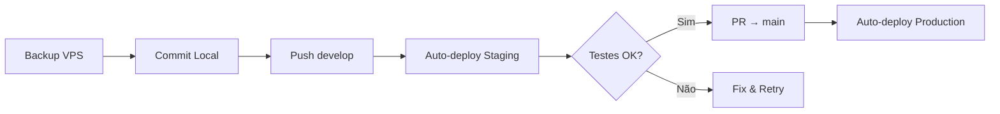

# Análise de Sincronização: Código Local vs VPS vs GitHub

**Data:** 27 de Janeiro de 2026  
**Autor:** Análise automatizada via GitHub Copilot  
**Status:** 🔴 AÇÃO REQUERIDA

---

## 📋 Resumo Executivo

Foi identificada uma **discrepância crítica** entre as versões do código:

| Ambiente | Linhas em `timesheet_service.py` | Status |
|----------|----------------------------------|--------|
| **Local (WSL)** | 837 linhas | ✅ Mais completo |
| **VPS Production** | 786 linhas | ⚠️ Código "fantasma" |
| **VPS Staging** | 729 linhas | ✅ Sincronizado com develop |
| **GitHub develop** | 729 linhas | ✅ Branch default |
| **GitHub main** | 684 linhas | ✅ Produção oficial |

### 🚨 Problema Principal

O VPS Production está rodando código que **não existe em nenhum branch do Git**. Uma LLM anterior fez deploy via `rsync` diretamente, bypassando o CI/CD do GitHub Actions.

---

## 🔍 Análise Detalhada

### Código Local (837 linhas) - O Mais Completo

O código local contém funcionalidades que **não estão em nenhum outro lugar**:

1. **Filtro por Iteração** (`_get_iteration_path()`)
   - Busca iteration path de um work item
   - Suporta filtro por sprint/iteração específica

2. **API de Work Items por Iteração** (`_get_work_items_by_iteration_api()`)
   - Nova API para buscar work items filtrados por iteração
   - Otimiza queries quando filtro de iteração está ativo

3. **Melhorias em `get_all_teams_work_items_hierarchy()`**
   - Parâmetro `iteration_filter` adicionado
   - Lógica de filtragem integrada

### Código VPS Production (786 linhas) - "Fantasma"

- Versão intermediária que não existe no Git
- Deploy feito via rsync por LLM anterior
- Diretório `/opt/aponta-production` **não tem .git**
- Impossível rastrear exatamente o que está rodando

### Arquivos Locais Modificados (Não Commitados)

```
M  .github/workflows/deploy-production.yml
M  .github/workflows/deploy-staging.yml
M  app/config.py
M  app/routers/__init__.py
M  app/schemas/iteration.py
M  app/services/projeto_service.py
M  app/services/timesheet_service.py
A  .github/workflows/rollback.yml
A  deploy/production/env.template
A  deploy/shared/env.template
A  deploy/staging/env.template
A  docs/DEPLOY.md
```

---

## 📊 Comparativo de Funcionalidades

| Funcionalidade | Local | VPS Prod | GitHub develop | GitHub main |
|----------------|-------|----------|----------------|-------------|
| Hierarquia básica de work items | ✅ | ✅ | ✅ | ✅ |
| Filtro por iteração | ✅ | ❌ | ❌ | ❌ |
| `_get_iteration_path()` | ✅ | ❌ | ❌ | ❌ |
| `_get_work_items_by_iteration_api()` | ✅ | ❌ | ❌ | ❌ |
| CORS para múltiplas orgs | ✅ | ? | ❌ | ❌ |
| Routers organization_pats | ✅ | ? | ❌ | ❌ |
| Routers iterations | ✅ | ? | ❌ | ❌ |

---

## 🎯 Opções de Ação

### Opção 1: Commit Local → Deploy via CI/CD (RECOMENDADA)

**Risco:** 🟢 BAIXO  
**Motivo:** Local tem MAIS código que VPS (837 > 786)

```bash
# 1. Backup VPS Production (por segurança)
ssh ubuntu@92.112.178.252 "cd /opt && sudo tar -czvf aponta-production-backup-$(date +%Y%m%d).tar.gz aponta-production"

# 2. Commit todas as mudanças locais
git add .
git commit -m "feat: filtro por iteração e melhorias DevOps"

# 3. Push para develop
git push origin develop

# 4. Verificar Staging (GitHub Actions fará deploy automático)
# Acessar: https://staging.aponta.sefaz.ce.gov.br/health

# 5. Se OK, criar PR develop → main
gh pr create --base main --head develop --title "Release: Filtro por Iteração"

# 6. Merge PR (deploy automático para production)
```

### Opção 2: Sincronizar VPS com GitHub Primeiro

**Risco:** 🔴 ALTO  
**Motivo:** Pode quebrar funcionalidades em produção que dependem do código "fantasma"

```bash
# NÃO RECOMENDADO - Pode causar downtime
```

### Opção 3: Investigar Código VPS Antes

**Risco:** 🟡 MÉDIO  
**Motivo:** Mais seguro, mas consome tempo

```bash
# Copiar código VPS para análise local
scp -r ubuntu@92.112.178.252:/opt/aponta-production/app/services/timesheet_service.py ./vps_timesheet_backup.py

# Fazer diff detalhado
diff -u vps_timesheet_backup.py app/services/timesheet_service.py
```

---

## ✅ Recomendação Final

**Prosseguir com Opção 1** pelos seguintes motivos:

1. **Local > VPS**: O código local (837 linhas) é um **superset** do código VPS (786 linhas)
2. **Sem perda de funcionalidade**: Tudo que está no VPS provavelmente está no local
3. **CI/CD correto**: Usar GitHub Actions garante rastreabilidade
4. **Rollback fácil**: Git permite reverter se necessário

### Sequência Recomendada



---

## 📝 Checklist Pré-Deploy

- [ ] Backup do VPS Production criado
- [ ] Todos os arquivos locais commitados
- [ ] Push para branch develop
- [ ] Staging testado e funcionando
- [ ] PR criado para main
- [ ] Review da PR aprovado
- [ ] Merge realizado
- [ ] Production verificado pós-deploy

---

## 🔧 Comandos Úteis

### Verificar Status Atual
```bash
# GitHub Actions - último deploy
gh run list --workflow=deploy-staging.yml --limit=3
gh run list --workflow=deploy-production.yml --limit=3

# VPS - containers rodando
ssh ubuntu@92.112.178.252 "docker ps --format 'table {{.Names}}\t{{.Status}}\t{{.Ports}}'"

# Health check
curl -s https://staging.aponta.sefaz.ce.gov.br/health | jq
curl -s https://aponta.sefaz.ce.gov.br/health | jq
```

### Rollback de Emergência
```bash
# Se algo der errado após deploy
gh workflow run rollback.yml -f environment=production -f commits=1
```

---

## 📚 Documentação Relacionada

- [DEPLOY.md](../DEPLOY.md) - Guia completo de deploy
- [DEVELOPMENT_GUIDE.md](../DEVELOPMENT_GUIDE.md) - Guia de desenvolvimento
- [GITHUB_ACTIONS_DEPLOY_STATUS.md](../GITHUB_ACTIONS_DEPLOY_STATUS.md) - Status dos workflows

---

*Documento gerado automaticamente para auxiliar na tomada de decisão sobre sincronização de código.*
